<!-- StaySphere | GitHub README -->
<div align="center">

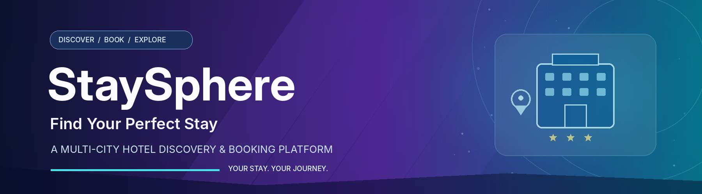

<br />

### Your stay. Your journey. Your StaySphere.

**A modern multi-city hotel discovery, room booking and customer support platform.**  
*Built with React + Vite, Python Flask and MySQL.*

<br />


<br /><br />


<br /><br />

[**Explore Features**](#features) · [**View Screenshots**](#gallery) · [**System Architecture**](#architecture) · [**Get Started**](#setup) · [**API Reference**](#apis)

</div>

---

## ✦ What is StaySphere?

**StaySphere — Find Your Perfect Stay** is a responsive full-stack application for exploring hotels across Indian cities, checking room availability, creating reservations and tracking bookings in one place. It pairs a traveller-facing experience with a dedicated administrator workspace, email-based account verification and a customer support workflow.

The project follows a clean three-layer architecture: **React** handles the interface, **Flask** exposes REST endpoints, and **MySQL** stores the business data. **phpMyAdmin** is used to manage the database; PHP is not the application backend.

> **Development/demo project:** Checkout is simulated and does not charge real money. The current StaySphere Assistant is rule-based and can use authenticated booking/support APIs; it does not require a paid generative-AI service. This README documents the base application plus the subsequent OTP, customer-management, support and chatbot updates discussed for this project.

<div align="center">
<table>
<tr>
  <td align="center"><b>12</b><br /><sub>Seeded destinations</sub></td>
  <td align="center"><b>120</b><br /><sub>Hotels with optional data expansions</sub></td>
  <td align="center"><b>2</b><br /><sub>Customer + admin areas</sub></td>
  <td align="center"><b>24/7 UI</b><br /><sub>Self-service help widget</sub></td>
</tr>
</table>
</div>

<sub>The displayed hotel count depends on the seed/expansion scripts imported into your local database. The screenshot gallery shows a build with 120 hotels.</sub>

---

## 📑 Contents

- [Core features](#features)
- [Application gallery — 14 screenshots](#gallery)
- [How StaySphere works](#workflows)
- [StaySphere Assistant and support](#assistant)
- [Technology stack](#tech-stack)
- [Architecture](#architecture)
- [Project structure](#structure)
- [Installation and local setup](#setup)
- [Database guide](#database)
- [REST API overview](#apis)
- [Security and project scope](#security)
- [Roadmap](#roadmap)

---

<a id="features"></a>

## 🚀 Core features

<table>
<tr>
<td width="50%" valign="top">
<h3>🧭 Hotel discovery</h3>
<ul>
<li>Home hero and destination search</li>
<li>Hotel cards, amenities and image galleries</li>
<li>City-wise browsing and featured hotels</li>
<li>Filter by budget, rating and destination</li>
<li>Sort results and view room options</li>
<li>Date-based room availability checking</li>
</ul>
</td>
<td width="50%" valign="top">
<h3>🧳 Customer booking</h3>
<ul>
<li>Customer registration and login</li>
<li>Email OTP verification / password reset</li>
<li>Guest details and special requests</li>
<li>Booking total, tax and service breakdown</li>
<li>Simulated checkout and confirmation</li>
<li>My Bookings, cancellation and wishlist</li>
</ul>
</td>
</tr>
<tr>
<td valign="top">
<h3>🛡️ Administrator workspace</h3>
<ul>
<li>Separate admin login</li>
<li>Dashboard for bookings, users and revenue</li>
<li>Hotel activation and management</li>
<li>Booking list and status management</li>
<li>Customer information and account status</li>
<li>Support ticket review, replies and resolution</li>
</ul>
</td>
<td valign="top">
<h3>💬 Assistance &amp; trust</h3>
<ul>
<li>Floating StaySphere chatbot</li>
<li>Booking/payment/cancellation guidance</li>
<li>Latest-booking lookup (authenticated)</li>
<li>Support request creation from chat</li>
<li>Ticket history and admin reply visibility</li>
<li>JWT role checks and bcrypt password hashes</li>
</ul>
</td>
</tr>
</table>

---

<a id="gallery"></a>

## 📸 Application gallery


### 01 / Welcome to StaySphere

<p align="center">
  <a href="docs/screenshots/01-home-hero.png">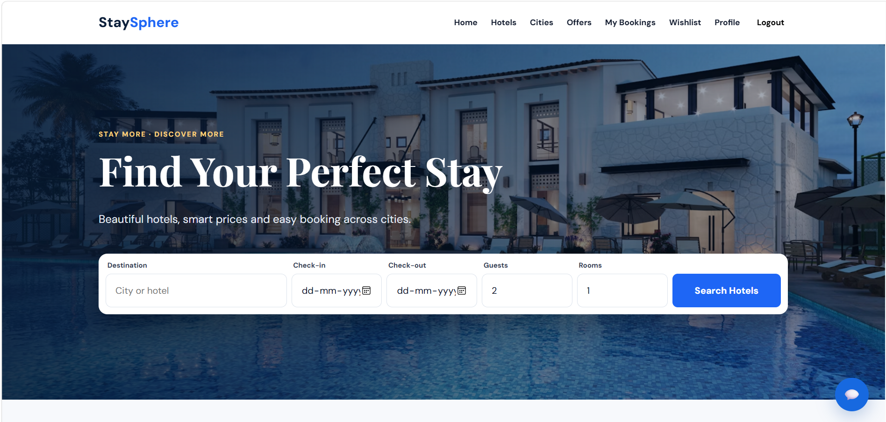</a><br />
  <sub>Logged-in home experience — hotel discovery begins here.</sub>
</p>

<p align="center">
  <a href="docs/screenshots/03-public-landing-page.png">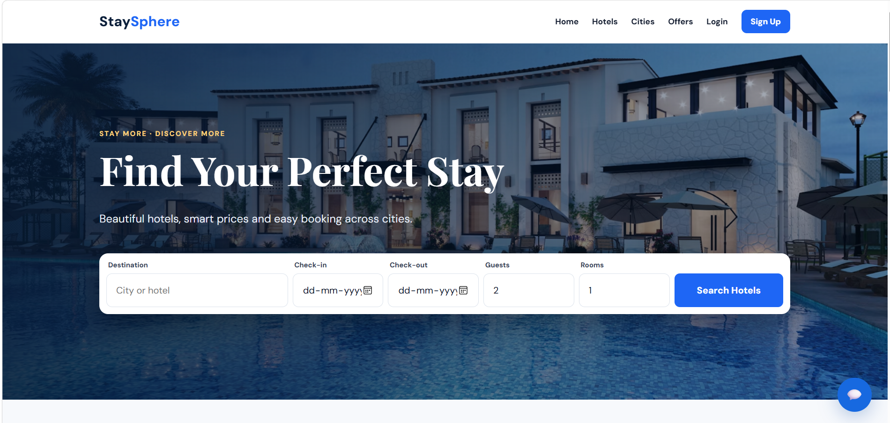</a>
  <a href="docs/screenshots/02-staysphere-chatbot.png">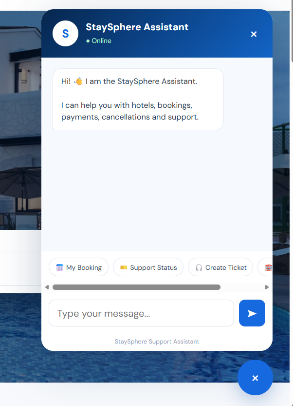</a><br />
  <sub>Public homepage alongside the floating StaySphere Assistant.</sub>
</p>

### 02 / Sign in & discover

<p align="center">
  <a href="docs/screenshots/04-customer-login.png">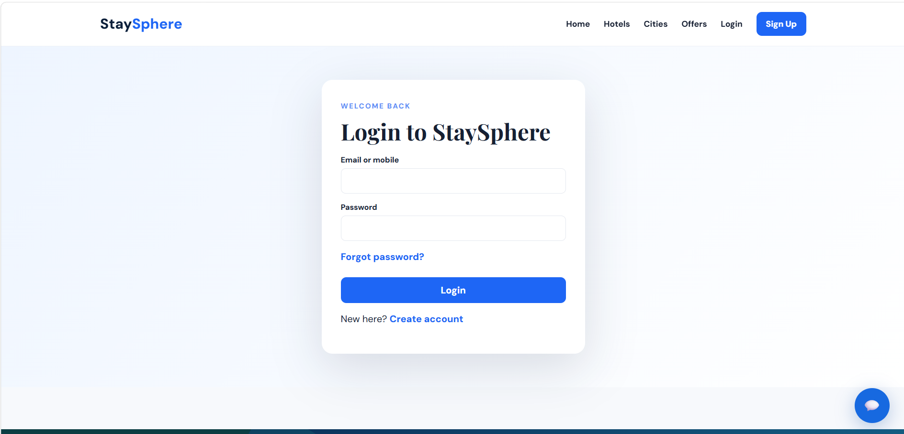</a>
  <a href="docs/screenshots/05-popular-cities-featured-hotels.png">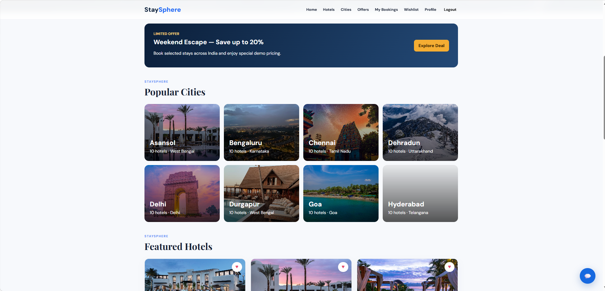</a><br />
  <sub>Customer sign-in • promotions • popular destinations • featured properties.</sub>
</p>

<p align="center">
  <a href="docs/screenshots/06-hotels-listing-filters.png">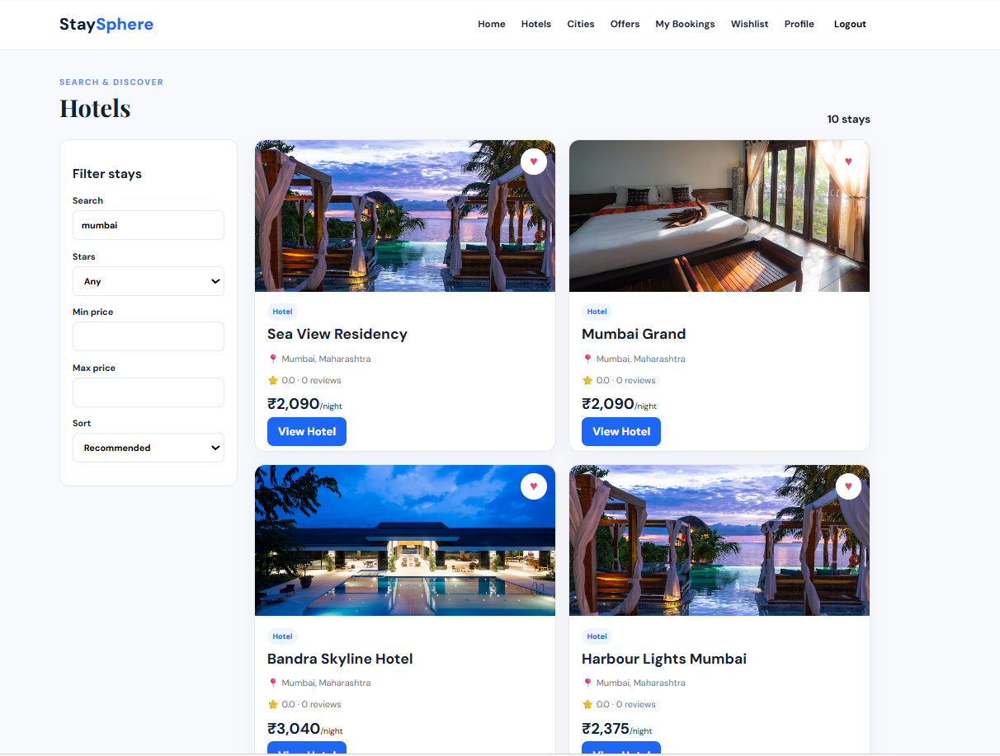</a><br />
  <sub>Hotel catalogue with filters, room pricing and property cards.</sub>
</p>

### 03 / Reservation journey

<p align="center">
  <a href="docs/screenshots/07-booking-guest-information.png">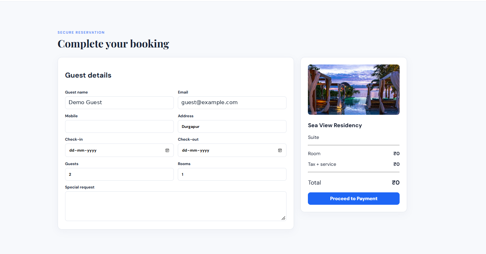</a>
  <a href="docs/screenshots/08-booking-room-summary.png">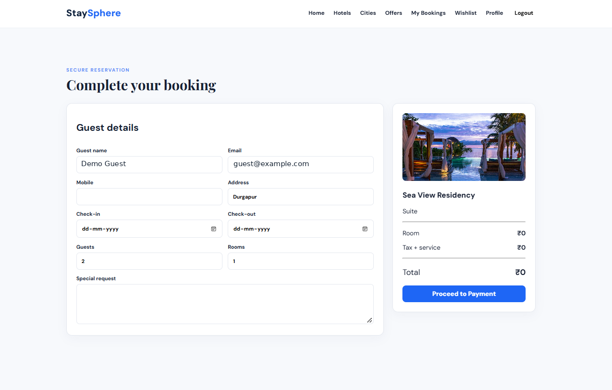</a><br />
  <sub>Enter guest information and review the selected room.</sub>
</p>

<p align="center">
  <a href="docs/screenshots/09-booking-form-validation.png">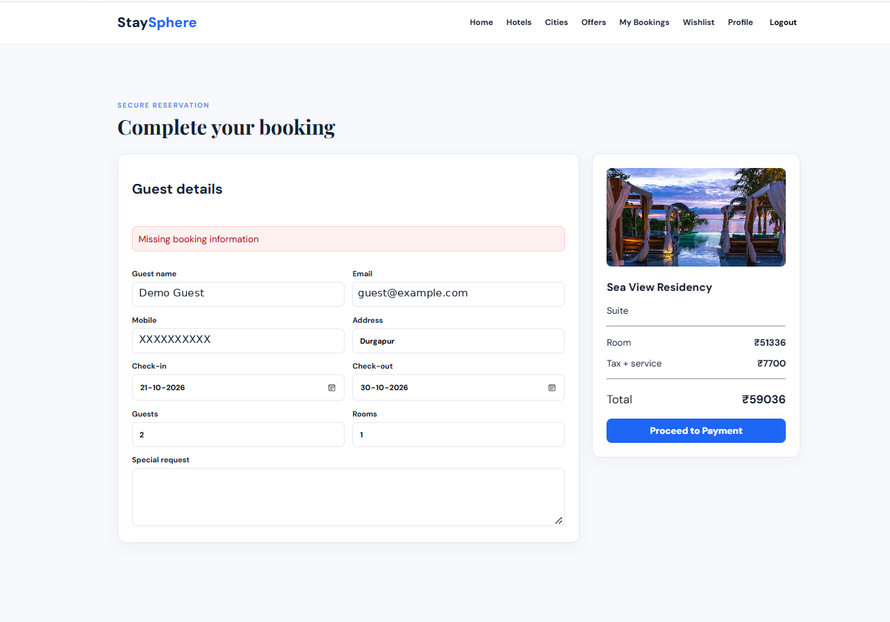</a><br />
  <sub>Form validation and real-time reservation cost summary.</sub>
</p>

<p align="center">
  <a href="docs/screenshots/10-secure-demo-checkout.png">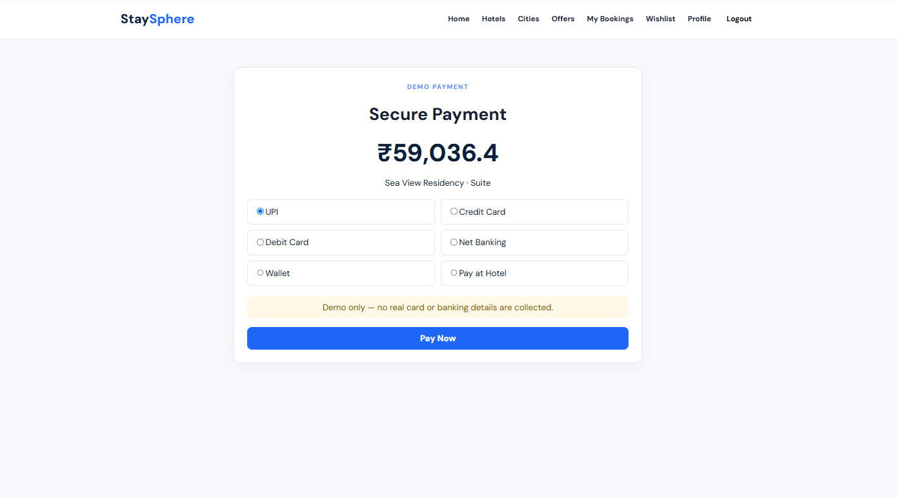</a>
  <a href="docs/screenshots/11-booking-success-confirmation.png">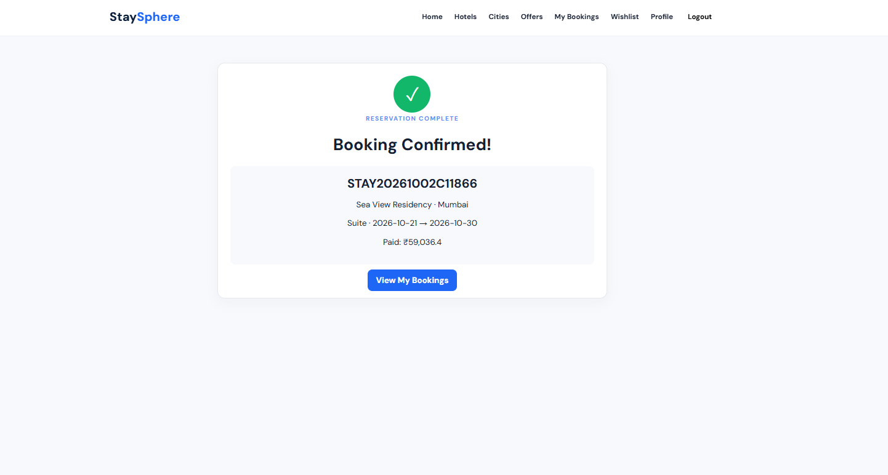</a><br />
  <sub>Demo payment → booking confirmation (no real money is collected).</sub>
</p>

<p align="center">
  <a href="docs/screenshots/12-my-bookings-history.png">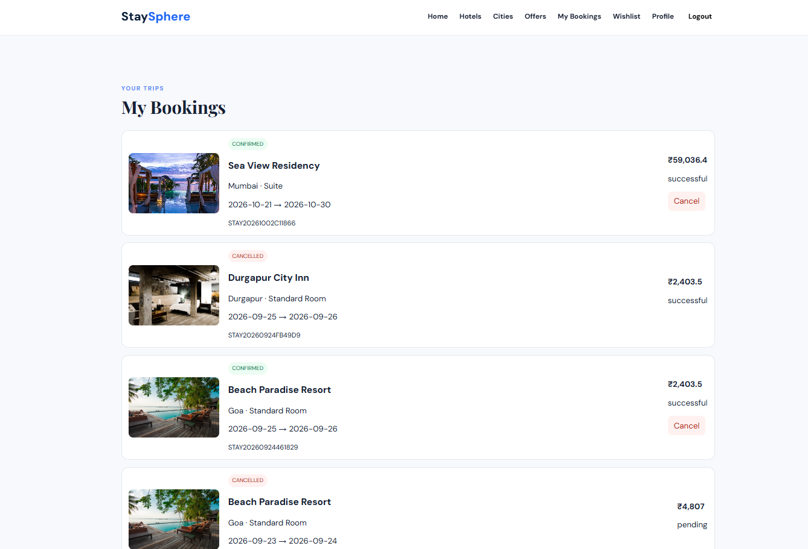</a><br />
  <sub>Track past and upcoming reservations in My Bookings.</sub>
</p>

### 04 / Admin control centre

<p align="center">
  <a href="docs/screenshots/13-administrator-login.png">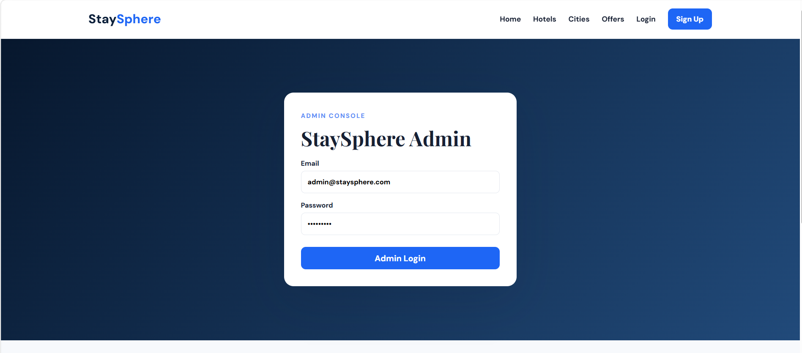</a>
  <a href="docs/screenshots/14-admin-dashboard-overview.png">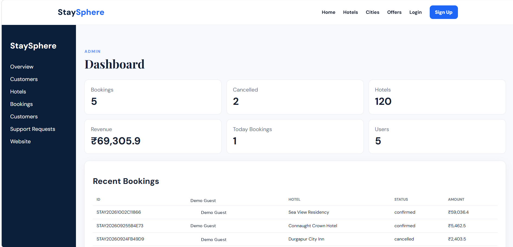</a><br />
  <sub>Dedicated admin authentication and a live database-driven overview.</sub>
</p>

<sub>Click any image to open its full-resolution version. The images are bundled locally; none rely on an external screenshot-hosting service.</sub>

---

<a id="workflows"></a>

## 🔄 How StaySphere works

### Traveller journey

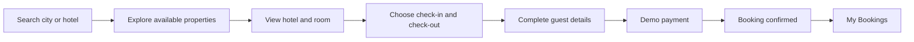
```mermaid
flowchart LR
 A[Search city or hotel] --> B[Explore available properties]
 B --> C[View hotel and room]
 C --> D[Choose check-in and check-out]
 D --> E[Complete guest details]
 E --> F[Demo payment]
 F --> G[Booking confirmed]
 G --> H[My Bookings]
```

### Admin journey

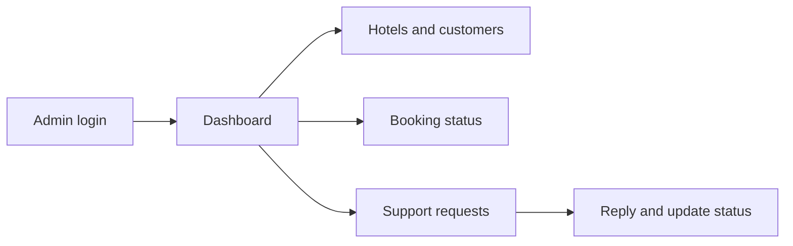
```mermaid
flowchart LR
 A[Admin login] --> B[Dashboard]
 B --> C[Hotels and customers]
 B --> D[Booking status]
 B --> E[Support requests]
 E --> F[Reply and update status]
```

---

<a id="assistant"></a>

## 🤖 StaySphere Assistant & support workflow

The on-page **StaySphere Assistant** helps users find the right page and answer common questions about bookings, hotels, payment, refunds, cancellations and accounts. The extended chatbot also calls existing protected Flask APIs for personal records; it does not invent customer booking details.

| What the visitor asks | Assistant action |
|---|---|
| “How can I book a hotel?” | Explain booking steps; link to Hotels. |
| “Show my latest booking.” | Call `GET /api/bookings/user` after login. |
| “Check my support status.” | Call `GET /api/support/my`; show stored admin reply if present. |
| “I still need help.” | Collect the issue, then call `POST /api/support`. |
| Unrecognized question | Offer navigation to Help & Support. |

**Support lifecycle**

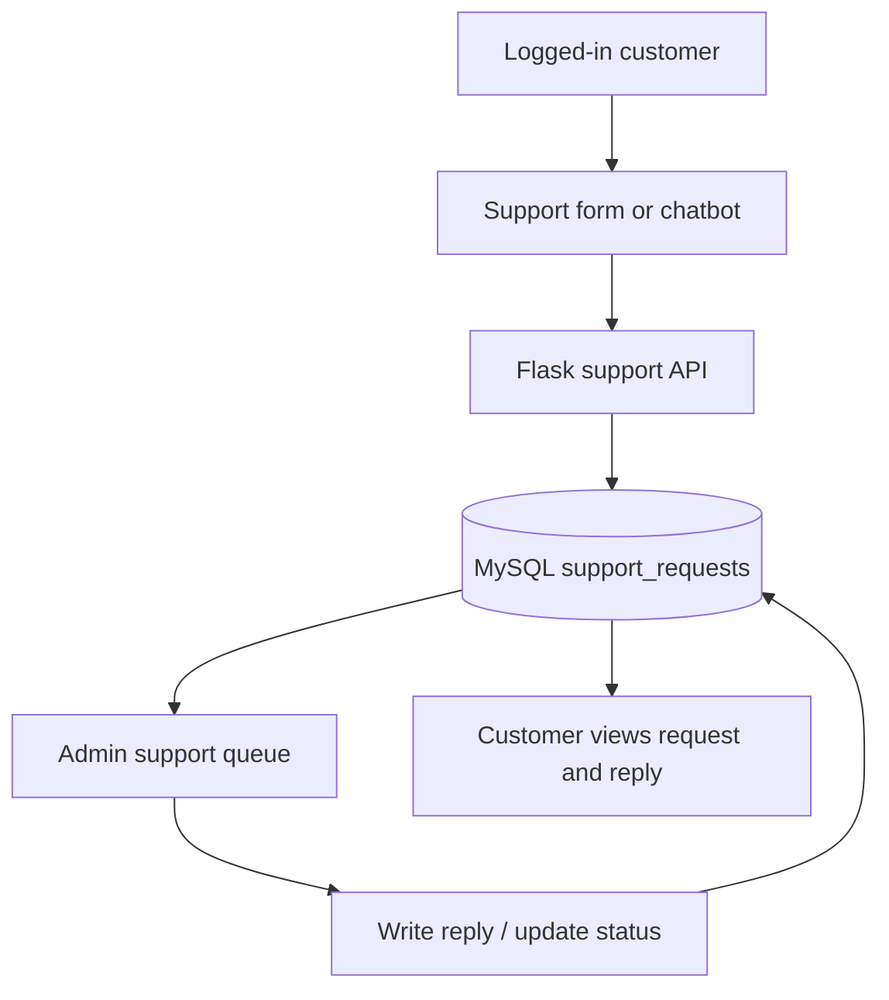
```mermaid
flowchart TB
 U[Logged-in customer] --> S[Support form or chatbot]
 S --> API[Flask support API]
 API --> DB[(MySQL support_requests)]
 DB --> A[Admin support queue]
 A --> R[Write reply / update status]
 R --> DB
 DB --> V[Customer views request and reply]
```

Tickets use three stages: `new` → `in_progress` → `resolved`. The `admin_reply` is stored with the ticket and can be shown on the customer's support page or fetched by the chatbot.

> The current assistant is a **rule-based help tool with database-connected actions**, not a Gemini/OpenAI model. A generative-AI upgrade is a future enhancement rather than a current dependency.

---

<a id="tech-stack"></a>

## 🧰 Technology stack

| Layer | Technologies | Purpose |
|---|---|---|
| Frontend | React, Vite, JavaScript, CSS, React Router | Responsive website, customer/admin routes and chatbot |
| HTTP | Axios | React ↔ Flask REST calls |
| Backend | Python, Flask, Flask-CORS | Business logic and endpoints |
| Database | MySQL, PyMySQL | Hotels, users, bookings, payments and support |
| Database administration | XAMPP / phpMyAdmin | Local MySQL creation/import and inspection |
| Identity and security | PyJWT, bcrypt | Token validation, role checks and password hashing |
| Email verification | SMTP + hashed OTP records | Registration verification and password recovery |

---

<a id="architecture"></a>

## 🏗️ Architecture

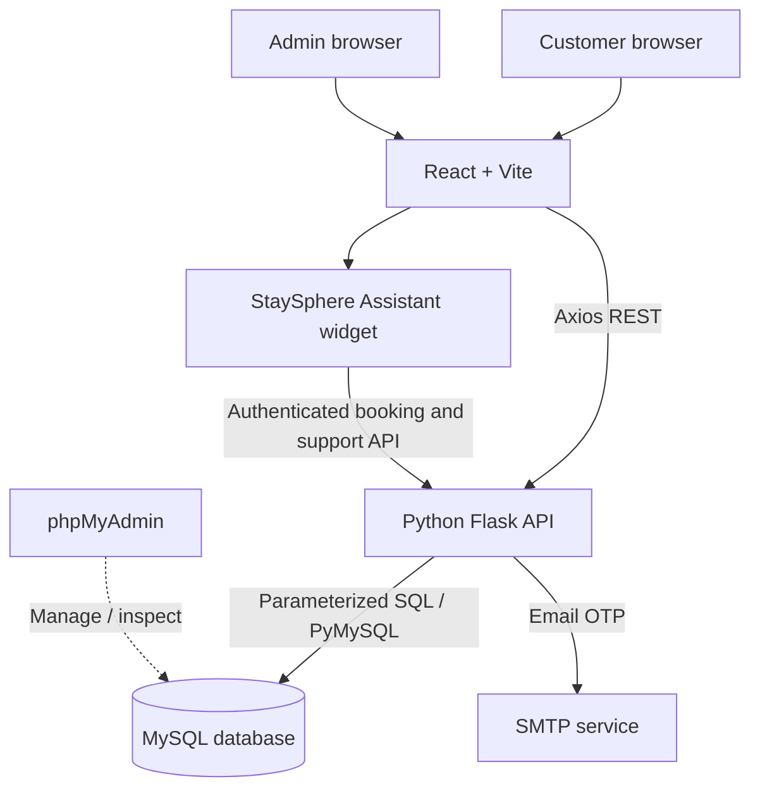
```mermaid
flowchart TB
  CUSTOMER[Customer browser] --> FRONTEND[React + Vite]
  ADMIN[Admin browser] --> FRONTEND
  FRONTEND -->|Axios REST| FLASK[Python Flask API]
  FLASK -->|Parameterized SQL / PyMySQL| MYSQL[(MySQL database)]
  PHPMYADMIN[phpMyAdmin] -. Manage / inspect .-> MYSQL
  FLASK -->|Email OTP| SMTP[SMTP service]
  FRONTEND --> CHAT[StaySphere Assistant widget]
  CHAT -->|Authenticated booking and support API| FLASK
```

<details>
<summary><b>Key data relationships</b></summary>

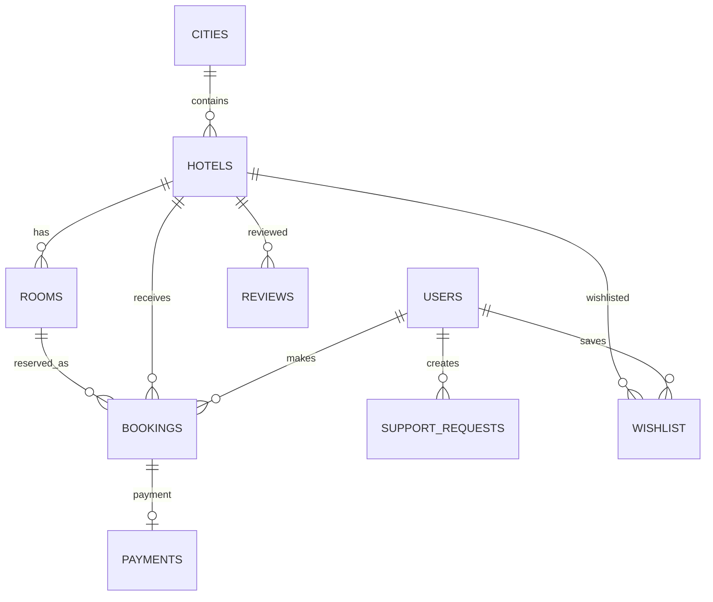
```mermaid
erDiagram
 USERS ||--o{ BOOKINGS : makes
 HOTELS ||--o{ ROOMS : has
 CITIES ||--o{ HOTELS : contains
 HOTELS ||--o{ BOOKINGS : receives
 ROOMS ||--o{ BOOKINGS : reserved_as
 BOOKINGS ||--o| PAYMENTS : payment
 USERS ||--o{ SUPPORT_REQUESTS : creates
 USERS ||--o{ WISHLIST : saves
 HOTELS ||--o{ WISHLIST : wishlisted
 HOTELS ||--o{ REVIEWS : reviewed
```

</details>

---

<a id="structure"></a>

## 🗂️ Project structure

The following shows the expected **application repository with the README assets added**. Some optional files are provided through separate updates/patches and must already be integrated into your own source project.

```text
StaySphere/
│
├── README.md
├── docs/
│   ├── assets/
│   │   └── staysphere-banner.png
│   └── screenshots/
│       ├── 01-home-hero.png
│       ├── 02-staysphere-chatbot.png
│       ├── ... 14 descriptive screenshots ...
│       └── SCREENSHOT_INDEX.md
│
├── frontend/
│   ├── src/
│   │   ├── components/       # Navbar, Footer, SearchBar, ChatBot (patch)
│   │   ├── context/          # Auth context
│   │   ├── pages/            # Customer pages, Support and Admin pages
│   │   ├── services/api.js   # Axios client
│   │   └── App.jsx           # Main routes and layout
│   ├── package.json
│   └── vite.config.js
│
├── backend/
│   ├── app.py                # Flask REST API
│   ├── otp_email.py          # Only after email-OTP update
│   ├── requirements.txt
│   └── .env                  # Local secrets; NEVER push to GitHub
│
└── database/
    ├── schema.sql
    ├── sample_data.sql
    └── additional migrations and hotel expansion scripts (if included)
```

---

<a id="setup"></a>

## ⚙️ Installation & local setup

### Prerequisites

- Python 3 and pip; Node.js and npm.
- MySQL (XAMPP works for local development) and phpMyAdmin.
- A local copy of the StaySphere **application source**, not just this README asset package.
- Optional: an SMTP account/App Password for OTP email features.

### Step 1 · Get your source and open it

Clone **your own** StaySphere repository, or extract the existing project source. Run the following commands from its project root.

### Step 2 · Set up MySQL

Start MySQL in XAMPP and visit `http://localhost/phpmyadmin`.

For a **brand-new empty development database**, import these files in order:

1. `database/schema.sql`
2. `database/sample_data.sql`
3. If using the extended catalogue: `add_more_hotels.sql`, followed by `add_to_10_hotels_per_city.sql` (place them in your database folder first).
4. Apply any OTP, customer-activity and support-table migrations required by your updated application version.

**Do not run the base `schema.sql` on an existing populated database.** The original file drops and recreates application tables and can destroy stored bookings/accounts. Back up your database before migrations.

### Step 3 · Configure and run Flask

**Windows PowerShell** (in the `backend/` folder):

```powershell
cd backend
python -m venv venv
.\venv\Scripts\Activate.ps1
pip install -r requirements.txt
Copy-Item .env.example .env
python app.py
```

Example `backend/.env` for local development (replace secrets with your own):

```dotenv
DB_HOST=127.0.0.1
DB_PORT=3306
DB_NAME=staysphere
DB_USER=root
DB_PASSWORD=
JWT_SECRET=replace-with-a-long-random-secret
FRONTEND_URL=http://localhost:5173
```

For the OTP update, also configure `SMTP_HOST`, `SMTP_PORT`, `SMTP_USER`, `SMTP_PASSWORD`, `SMTP_FROM_EMAIL` and `SMTP_FROM_NAME` according to the email helper. Never commit the SMTP App Password or your real `.env` file.

Check the backend health endpoint: **`http://localhost:5000/api/health`**.

### Step 4 · Start React / Vite

Open another terminal in the project root:

```powershell
cd frontend
npm install
Copy-Item .env.example .env
npm run dev
```

Frontend `.env`:

```dotenv
VITE_API_URL=http://localhost:5000/api
```

Open **`http://localhost:5173`**. If the page does not load, confirm MySQL is started, Flask is running on port `5000`, Vite is running on `5173`, and `.env` values match your setup.

### Step 5 · Try the features

Visit the homepage → choose a destination → view hotel/room details → select dates → create a reservation → complete the **demo** checkout → check My Bookings. For admin screens visit `/admin/login` using credentials configured in your own development seed. Do not put real passwords into public documentation.

---

<a id="database"></a>

## 🗃️ Database guide

| Main tables | Purpose |
|---|---|
| `users`, `admins` | Customer/admin identities and account fields |
| `cities`, `hotels`, `hotel_images` | Location/property catalogue |
| `rooms`, `amenities`, `hotel_amenities` | Room inventory and facilities |
| `bookings`, `payments` | Reservations and demo payment records |
| `reviews`, `wishlist`, `advertisements` | Reviews, favourites and banners |
| `email_otps` | OTP metadata and hashes (when migrated) |
| `support_requests` | Customer issue, `status`, `admin_reply` and timestamps (when added) |

**Catalogue expansion:** The original seed starts with a smaller set of properties. The two optional hotel scripts extend it to **4 hotels per city (48)** and then **10 hotels per city (120)** across the 12 seeded cities. The actual dashboard count depends on which scripts were imported.

**Room availability:** Existing pending/confirmed reservations are checked for overlapping dates and quantity before accepting a new booking. Payments in this repository are a demonstration only.

---

<a id="apis"></a>

## 🔌 REST API overview

<details open>
<summary><b>Public + customer endpoints</b></summary>

| Method | Path | Action |
|:---:|---|---|
| `GET` | `/api/health` | Health check |
| `POST` | `/api/auth/register` | Customer registration |
| `POST` | `/api/auth/login` | Customer authentication |
| `POST` | `/api/auth/verify-email` | Verify registration OTP (updated backend) |
| `POST` | `/api/auth/resend-verification` | Resend verification OTP (updated backend) |
| `POST` | `/api/auth/forgot-password` | Request password reset OTP (updated backend) |
| `POST` | `/api/auth/reset-password` | Change password using valid OTP (updated backend) |
| `GET` | `/api/cities` | Active destinations |
| `GET` | `/api/hotels` | Search, filters and ordering |
| `GET` | `/api/hotels/:id` | Hotel, room, gallery and reviews |
| `GET` | `/api/rooms/:hotelId/availability` | Check room stock for selected dates |
| `POST` | `/api/bookings` | Create reservation (login required) |
| `GET` | `/api/bookings/user` | Current customer's bookings |
| `POST` | `/api/payments` | Demo payment |
| `GET / PUT` | `/api/profile` | View/edit profile |
| `POST` | `/api/support` | Create support request or chatbot ticket |
| `GET` | `/api/support/my` | Customer's requests, status and admin replies |

</details>

<details>
<summary><b>Administrator endpoints</b></summary>

| Method | Path | Action |
|:---:|---|---|
| `POST` | `/api/admin/login` | Separate admin login |
| `GET` | `/api/admin/dashboard` | Summary metrics |
| `POST` | `/api/admin/hotels` | Add a hotel |
| `DELETE` | `/api/admin/hotels/:id` | Deactivate a hotel |
| `GET` | `/api/admin/bookings` | View reservations |
| `PUT` | `/api/admin/bookings/:id` | Update booking status |
| `GET` | `/api/admin/customers` | Customer details and activity |
| `PUT` | `/api/admin/customers/:id/status` | Activate/deactivate account |
| `GET` | `/api/admin/support` | Support ticket queue |
| `PUT` | `/api/admin/support/:id` | Save reply and update ticket status |

</details>

All API paths are relative to `http://localhost:5000`. Optional update endpoints require their corresponding backend/migration files to be integrated into the source repository.

---

<a id="security"></a>

## 🔐 Security & project scope

- User passwords are stored as **bcrypt hashes**; they cannot be viewed as plaintext by an administrator.
- JWT tokens are used to authorize customer-specific and admin operations.
- Booking and support history endpoints retrieve records scoped to the logged-in customer.
- Database writes use parameterized queries for application values.
- Email OTP codes are hashed and expire when the OTP module is enabled.
- The chatbot is **rule-based** and its support actions are subject to normal API authentication.
- All screenshots are from a **development/demo** build; selected personally identifiable fields have been anonymized.
- Real payment processing, production deployment, rate limiting, validation, audit logging and testing require additional review before a public commercial launch.

---

<a id="roadmap"></a>

## 🗺️ Roadmap

| In the development project / related update | Future extensions |
|---|---|
| Multi-city hotel catalogue and search | Automated end-to-end tests |
| Room availability + booking flow | Production deployment and monitoring |
| Demo payment and booking history | Verified real payment integration |
| Customer/admin sign-in and account tools | Admin notification emails for new tickets |
| Email OTP and recovery update | Conversational multi-turn ticket threads |
| Support ticket + admin reply update | Optional LLM-powered assistant |
| Database-connected rule-based chatbot patch | Accessibility and internationalization refinements |

---

<div align="center">

### Every journey deserves a great stay.

**StaySphere · Find Your Perfect Stay**

<sub>Made with React, Flask and MySQL • © 2026 StaySphere</sub>

</div>
